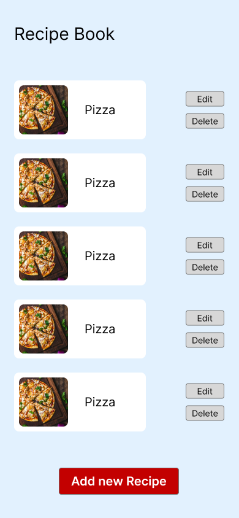
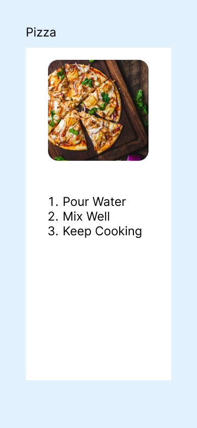

# Take-Home Assignment: Recipe Book

This repository contains the source code (and instructions) to start working on
the Take-Home assignments while interviewing at Weburz. The assignment is
intentionally kept simple (and **incomplete**) for the prospect to be able to
complete the rest of the project on their own in not more 72 hours (maximum!).

## The Project

The requirements of the project are stated below and we intend to evaluate your
programming as well as problem-solving skills through them. For starters, the
project is based on the idea of a "Recipe Book" where the end-users can perform
CRUD operations on the website.

You are expected to perform the following tasks on the project:

1. Create REST API endpoints to perform the CRUD operations.
2. Build the client-side service (we have shared an example UI/UX but you are
   free to make it look prettier).
3. Set up the database and ensure the server-side service can query data to/from
   it.

If you want to add some nifty and interesting functionality to the project, you
are encouraged to do so. Do take note that it is not something we expect and is
definitely not a necessity.

## UI/UX References

As mentioned earlier, you can take UI/UX inspiration from the provided example
below but you are free to share your own personalised rendition of the same. Do
remember, you will not be evaluated on your design skills and instead we will
focus primarily on your coding skills instead.

### All Recipe View



### Recipe View



### Edit Recipe View


### Add New Recipe


## Prerequisites for Development

You will need to follow these instructions to setup the development environment
for the project:

1. [Docker](https://www.docker.com), [Python](https://www.python.org),
   [Task](https://taskfile.dev) and [Node.js](https://www.nodejs.org) installed.
2. Fork the repository and clone it locally on your system.
3. Setup the local development environment by running:
   ```console
   task
   ```
4. Start writing code and developing the project.
5. Commit and push the new changes to your remote repository.
6. When prompted, make a PR to the upstream repository and reach out to us
   stating completion of the assignment.

**NOTE**: Post development, do not forget to clean up any lingering resources
and artifacts from your development environment!

```console
task clean
```

## Frequently Asked Questions (FAQs)

**What is the evaluation criteria?**

We will be evaluating you and your submission based on the following criteria:

1. **Code Quality** – How you write code while also ensuring it is clean and
   maintainable?
2. **Testing** – How you reasons about what and how to test sections of the
   source code?
3. **Performance** – How you identify performance bottlenecks and attempt to
   resolve it.
4. **System Design** – How you reason about core Software Development concepts
   like reusability, separation of concerns and various other abstractions.
5. **Infrastructure & Operations** – How will you set up a system to run the
   software on and maintain the documentations for it.

**What tech stack should be used?**

You should be using Python on the server-side service and
[Nuxt.js](https://nuxt.com) on the client-side service.

**What libraries and frameworks am I allowed to use?**

We use [FastAPI](https://fastapi.tiangolo.com) on all our services and Nuxt.js
on all client-side services. We expect you to use the same but we can be lenient
in this regards, hence feel free to use whichever framework you are comfortable
with. Although a higher preferences will be given to you if you chose to go with
the libraries and frameworks of our choice.

**I need help, can I reach out to someone?**

Absolutely! We are always available to help you setup the project or something
else as long as it is not the solution to the assignment you have a question
about!
